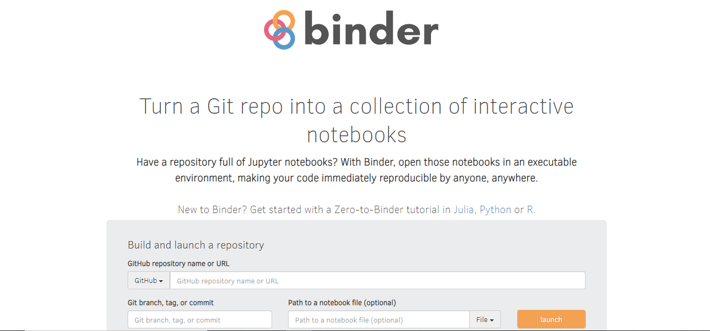
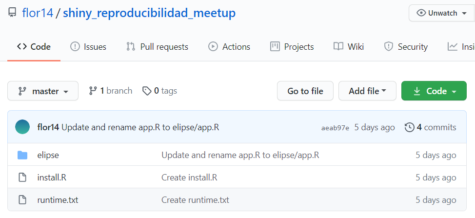

```{r setup, include=FALSE}
options(htmltools.dir.version = FALSE, echo = FALSE)
```

```{r xaringan-themer, include=FALSE, warning=FALSE}
library(xaringanthemer)
style_duo_accent(
  primary_color = "#01CC99",
  secondary_color = "#C3EBE2",
    link_color= "#245239",
  inverse_header_color = "#2E414D", 
  code_inline_color = "#179c55",
    code_font_family = "GlacialIndifferenceRegular",
  code_font_url = "https://fontlibrary.org/face/glacial-indifference",
  text_font_family = "GlacialIndifferenceRegular",
  text_font_size = "25px",
  text_font_url = "https://fontlibrary.org/face/glacial-indifference",
  header_font_family = "Sifonn",
  header_font_url = "https://fonts.cdnfonts.com/css/sifonn",
)

```


class: center, middle


<a rel="license" href="http://creativecommons.org/licenses/by-sa/4.0/"></a><br />This work is licensed under a <a rel="license" href="http://creativecommons.org/licenses/by-sa/4.0/">Creative Commons Attribution-ShareAlike 4.0 International License</a>


---

# Hello! 👋

Here I would like to share with you this code I am working on. Let me know if you have any problems.

[![badge](https://img.shields.io/badge/run-binder-E66581.svg?logo=data:image/png;base64,iVBORw0KGgoAAAANSUhEUgAAAFkAAABZCAMAAABi1XidAAAB8lBMVEX///9XmsrmZYH1olJXmsr1olJXmsrmZYH1olJXmsr1olJXmsrmZYH1olL1olJXmsr1olJXmsrmZYH1olL1olJXmsrmZYH1olJXmsr1olL1olJXmsrmZYH1olL1olJXmsrmZYH1olL1olL0nFf1olJXmsrmZYH1olJXmsq8dZb1olJXmsrmZYH1olJXmspXmspXmsr1olL1olJXmsrmZYH1olJXmsr1olL1olJXmsrmZYH1olL1olLeaIVXmsrmZYH1olL1olL1olJXmsrmZYH1olLna31Xmsr1olJXmsr1olJXmsrmZYH1olLqoVr1olJXmsr1olJXmsrmZYH1olL1olKkfaPobXvviGabgadXmsqThKuofKHmZ4Dobnr1olJXmsr1olJXmspXmsr1olJXmsrfZ4TuhWn1olL1olJXmsqBi7X1olJXmspZmslbmMhbmsdemsVfl8ZgmsNim8Jpk8F0m7R4m7F5nLB6jbh7jbiDirOEibOGnKaMhq+PnaCVg6qWg6qegKaff6WhnpKofKGtnomxeZy3noG6dZi+n3vCcpPDcpPGn3bLb4/Mb47UbIrVa4rYoGjdaIbeaIXhoWHmZYHobXvpcHjqdHXreHLroVrsfG/uhGnuh2bwj2Hxk17yl1vzmljzm1j0nlX1olL3AJXWAAAAbXRSTlMAEBAQHx8gICAuLjAwMDw9PUBAQEpQUFBXV1hgYGBkcHBwcXl8gICAgoiIkJCQlJicnJ2goKCmqK+wsLC4usDAwMjP0NDQ1NbW3Nzg4ODi5+3v8PDw8/T09PX29vb39/f5+fr7+/z8/Pz9/v7+zczCxgAABC5JREFUeAHN1ul3k0UUBvCb1CTVpmpaitAGSLSpSuKCLWpbTKNJFGlcSMAFF63iUmRccNG6gLbuxkXU66JAUef/9LSpmXnyLr3T5AO/rzl5zj137p136BISy44fKJXuGN/d19PUfYeO67Znqtf2KH33Id1psXoFdW30sPZ1sMvs2D060AHqws4FHeJojLZqnw53cmfvg+XR8mC0OEjuxrXEkX5ydeVJLVIlV0e10PXk5k7dYeHu7Cj1j+49uKg7uLU61tGLw1lq27ugQYlclHC4bgv7VQ+TAyj5Zc/UjsPvs1sd5cWryWObtvWT2EPa4rtnWW3JkpjggEpbOsPr7F7EyNewtpBIslA7p43HCsnwooXTEc3UmPmCNn5lrqTJxy6nRmcavGZVt/3Da2pD5NHvsOHJCrdc1G2r3DITpU7yic7w/7Rxnjc0kt5GC4djiv2Sz3Fb2iEZg41/ddsFDoyuYrIkmFehz0HR2thPgQqMyQYb2OtB0WxsZ3BeG3+wpRb1vzl2UYBog8FfGhttFKjtAclnZYrRo9ryG9uG/FZQU4AEg8ZE9LjGMzTmqKXPLnlWVnIlQQTvxJf8ip7VgjZjyVPrjw1te5otM7RmP7xm+sK2Gv9I8Gi++BRbEkR9EBw8zRUcKxwp73xkaLiqQb+kGduJTNHG72zcW9LoJgqQxpP3/Tj//c3yB0tqzaml05/+orHLksVO+95kX7/7qgJvnjlrfr2Ggsyx0eoy9uPzN5SPd86aXggOsEKW2Prz7du3VID3/tzs/sSRs2w7ovVHKtjrX2pd7ZMlTxAYfBAL9jiDwfLkq55Tm7ifhMlTGPyCAs7RFRhn47JnlcB9RM5T97ASuZXIcVNuUDIndpDbdsfrqsOppeXl5Y+XVKdjFCTh+zGaVuj0d9zy05PPK3QzBamxdwtTCrzyg/2Rvf2EstUjordGwa/kx9mSJLr8mLLtCW8HHGJc2R5hS219IiF6PnTusOqcMl57gm0Z8kanKMAQg0qSyuZfn7zItsbGyO9QlnxY0eCuD1XL2ys/MsrQhltE7Ug0uFOzufJFE2PxBo/YAx8XPPdDwWN0MrDRYIZF0mSMKCNHgaIVFoBbNoLJ7tEQDKxGF0kcLQimojCZopv0OkNOyWCCg9XMVAi7ARJzQdM2QUh0gmBozjc3Skg6dSBRqDGYSUOu66Zg+I2fNZs/M3/f/Grl/XnyF1Gw3VKCez0PN5IUfFLqvgUN4C0qNqYs5YhPL+aVZYDE4IpUk57oSFnJm4FyCqqOE0jhY2SMyLFoo56zyo6becOS5UVDdj7Vih0zp+tcMhwRpBeLyqtIjlJKAIZSbI8SGSF3k0pA3mR5tHuwPFoa7N7reoq2bqCsAk1HqCu5uvI1n6JuRXI+S1Mco54YmYTwcn6Aeic+kssXi8XpXC4V3t7/ADuTNKaQJdScAAAAAElFTkSuQmCC)](https://mybinder.org/v2/gh/flor14/reproducibilidad_meetup/master?urlpath=rstudio)

--

**Issue 1**

Absolute path 

--

**Issue 2**

Package version of `tidyr 0.8.3` does not include `pivot_longer()` and `pivot_wider()` functions added in `tidyr version 1.0.0`

Use `sessionInfo()` to check this

---

class: inverse, center, middle

# Would I have reproducible work only sharing the code and the data?

---


class: center, middle, inverse

# Reproducible environments 


---

## There are several tools to capture computational environments


* Package management systems (📦`packrat` -📦 `renv`)

* Binder

* Virtual machines 

* Containers

.footnote[[More details in The Turing Way Handbok](https://www.turing.ac.uk/research/research-projects/turing-way-handbook-reproducible-data-science)]

---

class: center

# Package management systems

**`renv` package**

```{r echo = FALSE}
knitr::include_graphics("images/renv.png")
```
.footnote[[Reproducible Environments - RStudio](https://environments.rstudio.com/)]
---

# `renv` package

1. 🏁 `renv::init()` works by creating a new library. A library stores installed packages.

--

2. 📸 `renv::snapshot()` creates a new file in your project titled `renv.lock`. The file contains all the information you need to communicate your project’s dependencies at the moment you call snapshot. 

--
3. 🌱 `renv::restore()` recreates the environment!


.footnote[[* Read more about `renv` here](https://environments.rstudio.com/snapshot.html#pre-requisite-steps)]

---


class: center

# Binder


[Jupyter Notebooks](https://mybinder.org/v2/gh/binder-examples/r/master?filepath=index.ipynb)

[Shiny](https://mybinder.org/v2/gh/flor14/shiny_reproducibilidad_meetup/master?urlpath=shiny/elipse/)

[RStudio](http://mybinder.org/v2/gh/flor14/shiny_reproducibilidad_meetup/master?urlpath=rstudio)

[Tutorial 1 - Ines Montani](https://noamross.github.io/gams-in-r-course/)

[Tutorial 2 - LearnR](https://mybinder.org/v2/gh/syoh/learnr-tutorial/master?urlpath=shiny/test1/)


---

# Binder

Binder is an open source web service that lets users create sharable, interactive, reproducible environments in the cloud.


```{r echo = FALSE}
knitr::include_graphics("images/binderlogo.png")
```


---

.pull-left[
## Advantages

- Easy to use

- You can access the infomation with one click

- It is free
]
.pull-right[
## Limitations

- Computational power

- Security/privacy (using `mybinder.org` BinderHub)

- Also no FTP for connecting to some data.
]

---

class: inverse, center, middle, 

## ☁💻☁
### Binder’s goal is to lower the barrier to interactivity, and to allow users to utilize code that is hosted in repository providers such as GitHub

.footnote[[Binder 2.0 - Reproducible, interactive, sharable environments for science at scale](https://pdfs.semanticscholar.org/c043/bef741a9616d1144e0205ac21ceae881485d.pdf)]

---

# mybinder.org 

A free, public BinderHub. Because it is public, you should not use it if your project requires personal or confidential information (such as passwords).

```{r echo=FALSE}

```


---

## "Binderizing" your project 🌀

**1-** Specify the computational environment

➕📄 **intall.R** 

➕📄 **runtime.txt** 

--

**2-** Upload the project files to a publicly available repository hosting service, such as **GitHub / GitLab**

--

**3-** "Binderize" the project (**mybinder.org**) ⏳ 

--

**4-** Use the correct URL 🔗

---
class: middle, center, inverse

## ☁💻☁
# Demo


---

## ➕📄 `install.R`  

> This file should have listed all of the packages to be installed 

```{r eval=FALSE, include=TRUE}
install.packages("ggplot2")
install.packages("shiny")
```


---

# What is MRAN? 📷

Since September 17th, 2014, the checkpoint server has been taking a daily snapshot 📸 at precisely midnight UTC of the entire CRAN repository and storing it on [Microsoft R Archived Network (MRAN)](https://mran.microsoft.com/documents/rro/reproducibility#reproducibility)


--
> ⚠ Non-CRAN packages, such as those available on GitHub, are not part of the snapshot process.
--

.footnote[[MRAN](https://mran.microsoft.com/)]

---

# EXTRA: `checkpoint` package

⏱  `checkpoint` package allows you to install packages as they existed on CRAN on a specific snapshot date as if you had a CRAN time machine.


```{r eval=FALSE, include=TRUE}
library(checkpoint)
checkpoint("YYYY-MM-DD") 
```


.footnote[[`checkpoint` package](https://mran.microsoft.com/documents/rro/reproducibility#checkpointpkg)]
---


# ➕📄 `runtime.txt`

> Specify the R and package versions used

For this you must choose a date where the versions of your packages are captured in MRAN.


**`r-version-<YYYY>-<MM>-<DD>`**


[*READ HERE - Important about R versions*](https://github.com/binder-examples/r)
---

# ➕📄 `runtime.txt`


```{r eval=FALSE, include=TRUE}
r-3.6-2020-08-20 #r-version-<YYYY>-<MM>-<DD>
```


---


# 2. Upload your code to the repository


```{r echo = FALSE}

```


---

# 3. "Binderize" your project 🌀

a. Go to https://mybinder.org

--

b. Paste the repository URL 
`https://github.com/<your-username>/<your-repository>`

--

c. Finally, click the `Launch` button. 

---

class: center, middle, inverse

# Patience! This could take a while ⏳


---


# RStudio IDE URL 💻


➕**`?urlpath=rstudio`**


You should call the binderized project using this template link

`https://mybinder.org/v2/gh/<user>/<repository>/<branch>?urlpath?rstudio`

Example 🔗:
http://mybinder.org/v2/gh/flor14/shiny_reproducibilidad_meetup/master?urlpath=rstudio


.footnote[[Ejemplos en el repositorio de Binder](https://github.com/binder-examples/r)]
---

# Shiny app URL ✨

➕**`?urlpath=shiny/<folder>/`**

You should call the binderized project using this template link

`https://mybinder.org/v2/gh/<user>/<repository>/<branch>?urlpath=shiny/<folder>/`

Example 🔗:
https://mybinder.org/v2/gh/flor14/shiny_reproducibilidad_meetup/master?urlpath=shiny/elipse/


.footnote[[Ejemplos en el repositorio de Binder](https://github.com/binder-examples/r)]

---
#Tutorials 💻👩


* [Ines Montani framwework uses Binder](https://github.com/ines/course-starter-r)

* [Interactive Tutorial with learnr and Binder - Sang-Yun Oh blog post](https://syoh.org/learnr-tutorial/)


---

# Others


✅ [Holepunch Package](https://karthik.github.io/holepunch/articles/getting_started.html)


✅ Faster installation

  [r-conda](https://github.com/binder-examples/r-conda)
 

✅ [More info about Binder](https://mybinder.readthedocs.io/en/latest/faq.html)

--

🐳 Changes to Docker terms of service on November 1. Lack of activity for 6 months could leave links inactive.

❓discourse.jupyter.org

---
class: middle, inverse, center 

# Practice 💪


---

# Exercise


Could you modify the code from the first exercise to make it work?


---

class: inverse

# Links 🔗

* [Binder 2.0 - Reproducible, interactive, sharable environments for science at scale](https://pdfs.semanticscholar.org/c043/bef741a9616d1144e0205ac21ceae881485d.pdf)

* [Reproducibility in Production - Webinar](https://rstudio.com/resources/webinars/reproducibility-in-production/)

* [The Turing Way Book](https://the-turing-way.netlify.app/)

* [Reproducible Environments - RStudio](https://environments.rstudio.com/)

* [renv: Project Environments with R - RStudio blog](https://blog.rstudio.com/2019/11/06/renv-project-environments-for-r/)

* [Putting the R into Reproducible Research - Anna Krystalli](https://annakrystalli.me/talks/r-in-repro-research.html#1)

* [Demo renv package](https://environments.rstudio.com/snapshot.html#watch-a-video-demo-of-snapshot-and-restore-with-renv)

---

class: center, middle

# ♻
# ¡Thank you!


Web [florencia.netlify.app](florencia.netlify.app)

Twitter [@cantoflor87](twitter.com/cantoflor_87)


